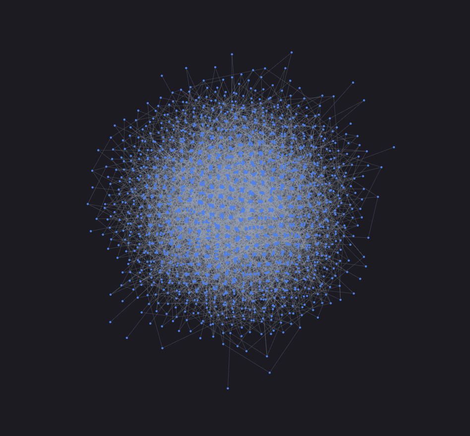

# CytoscapeJS.jl

A small Julia wrapper around [Cytoscape.js](https://js.cytoscape.org/), using [Bonito.jl](https://github.com/SimonDanisch/Bonito.jl).


## Usage

```julia
using Bonito
using CytoscapeJS

elements = [
    (; data = (; id = "a", label = "A")),
    (; data = (; id = "b", label = "B")),
    (; data = (; id = "ab", source = "a", target = "b")),
]

stylesheet = [
    (; selector = "node", style = Dict(
        "label" => "data(label)",
        "color" => "#3b82f6",
    )),
    (; selector = "edge", style = Dict(
        "target-arrow-shape" => "triangle",
        "curve-style" => "bezier",
    )),
]

graph = Cytoscape(elements; stylesheet)
display(App(graph))

# modify the graph
graph.elements[] = [graph.elements[]..., (; data = (; id = "c", label = "C"))]

# get state
on(graph.selection) do ids
    @info "selected" ids
end

on(graph.hovered) do id
    @info "hovered" id
end

on(graph.positions) do positions
    @info "positions changed" positions
end

# update viewport
fit!(graph)
center!(graph)
```

### Compound nodes

```julia
elements = [
    (; data = (; id = "gene1", label = "Gene 1")),
    (; data = (; id = "mrna1", label = "mRNA", parent = "gene1")),
    (; data = (; id = "protein1", label = "Protein", parent = "gene1")),

    (; data = (; id = "gene2", label = "Gene 2")),
    (; data = (; id = "mrna2", label = "mRNA", parent = "gene2")),
    (; data = (; id = "protein2", label = "Protein", parent = "gene2")),

    (; data = (; id = "translation1", source = "mrna1", target = "protein1")),
    (; data = (; id = "regulation", source = "protein1", target = "gene2")),
    (; data = (; id = "translation2", source = "mrna2", target = "protein2")),
]

stylesheet = [
    (; selector = "node", style = Dict(
        "label" => "data(label)",
        "color" => "#3b82f6",
    )),
    (; selector = ":parent", style = Dict(
        "background-opacity" => 0.15,
        "border-width" => 2,
        "border-color" => "#64748b",
        "padding" => "24px",
        "text-valign" => "top",
    )),
    (; selector = "edge", style = Dict(
        "width" => 2,
        "curve-style" => "bezier",
        "target-arrow-shape" => "triangle",
    )),
]

graph = Cytoscape(elements; stylesheet)
```

### Animated layouts

```julia
graph = Cytoscape(
    elements;
    stylesheet,
    layout=(; name="fcose", animate=true),
)
```

### Tooltips

```julia
elements = [
    (; data=(; id="a", label="A", tooltip="gene A")),
    (; data=(; id="b", label="B", tooltip="gene B")),
    (; data=(;
        id="ab",
        source="a",
        target="b",
        tooltip="activation\nA → B\nk = 1.2",
    )),
]

graph = Cytoscape(
    elements;
    tooltip_attributes=(; class="network-tooltip"), # or disable with `tooltip_attributes=nothing`
)

display(App(DOM.div(
    DOM.style("""
        .network-tooltip {
            padding: 6px 8px;
            background: white;
            border: 1px solid #9ca3af;
            border-radius: 4px;
            white-space: pre-line;
        }
    """),
    graph,
)))
```

### Selection

```julia
graph = Cytoscape(elements)

on(graph.selection) do ids
    @info "selected" ids
end

graph.selection[] = ["a", "b"]
```

The selection is also exposed to the page as `container.cytoscape.selection`, allowing synchronisation with other widgets without roundtripping through Julia:

```julia
app = App() do session
    graph = Cytoscape(elements)
    readout = DOM.span()
    clear = DOM.button("clear")
    container = DOM.div(graph, DOM.div(readout, clear))

    onload(session, container, js"""
        container => {
            const graph = container.querySelector("div");

            container.addEventListener("cytoscape:selection", event => {
                if (event.target !== graph) return;
                const ids = event.detail.selection;
                container.querySelector("span").textContent =
                    ids.length ? `selected: ${ids.join(", ")}` : "nothing selected";
            });

            container.querySelector("button").addEventListener("click", () => {
                graph.cytoscape.selection.set([]);
            });
        }
    """)

    container
end
```

### Web fonts

```julia

stylesheet = [
    (; selector="node", style=Dict(
        "label" => "data(label)",
        "font-family" => "Montserrat",
        "font-weight" => 500,
    ))
]
graph = Cytoscape(elements; stylesheet)

display(App(DOM.div(
    DOM.link(;
        rel="stylesheet",
        href="https://fonts.googleapis.com/css2?family=Montserrat:wght@500&display=swap",
    ),
    # this hidden span ensures the browser loads the font before Cytoscape renders its canvas labels
    DOM.span(
        "Montserrat";
        style="position:absolute; visibility:hidden; font:500 16px Montserrat",
    ),
    graph,
)))
```

### Enabling WebGL

Cytoscape.js has experimental WebGL support making it feasible to render large graphs.

```julia
nodes = [(; data=(; id="$i", label="$i")) for i in 1:2000]
edges = [
    (; data=(; id="$i-$(i + 1)", source="$i", target="$(i + 1)"))
    for i in 1:1999
]

graph = Cytoscape([nodes; edges]; renderer=(; name="canvas", webgl=true))
```

