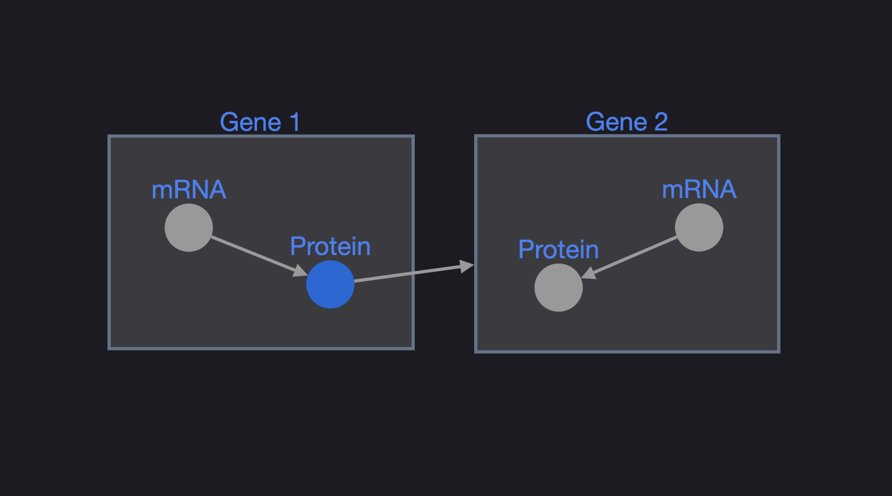

# CytoscapeJS.jl

A small Julia wrapper around [Cytoscape.js](https://js.cytoscape.org/), using [Bonito.jl](https://github.com/SimonDanisch/Bonito.jl).



## Usage

```julia
using Bonito
using CytoscapeJS

elements = [
    (; data = (; id = "a", label = "A")),
    (; data = (; id = "b", label = "B")),
    (; data = (; id = "ab", source = "a", target = "b")),
]

stylesheet = [
    (; selector = "node", style = Dict(
        "label" => "data(label)",
        "background-color" => "#3b82f6",
    )),
    (; selector = "edge", style = Dict(
        "target-arrow-shape" => "triangle",
        "curve-style" => "bezier",
    )),
]

# for large networks, enable webgl rendering
graph = Cytoscape(elements; stylesheet, renderer=(;name="canvas", webgl=false))
display(App(graph))

# modify the graph
graph.elements[] = [graph.elements[]..., (; data = (; id = "c", label = "C"))]

# get state
on(graph.selection) do ids
    @info "selected" ids
end

on(graph.hovered) do id
    @info "hovered" id
end

on(graph.positions) do positions
    @info "positions changed" positions
end

# update viewport
fit!(graph)
center!(graph)
```
